# 💧 AquaGuardian — Smart Water Drinking Reminder System

<p align="center">
  
  
  
  
</p>

<p align="center">
  <b>💧 A Smart Embedded System for Timely Hydration Reminders and Daily Water Tracking</b>
</p>

---

## 🌊 About the Project

**AquaGuardian** is an embedded-based **Smart Water Drinking Reminder System** developed using the **LPC2148 ARM7 microcontroller**.

The system helps users maintain regular water intake by generating periodic drinking reminders. It combines an **RTC, LCD, matrix keypad, external interrupt, push button, LEDs and buzzer** to provide an interactive hydration-monitoring system.

The user can configure:

* ⏰ RTC Time
* 📅 RTC Date
* 🎯 Daily Water Goal
* 🔔 Reminder Interval

The system tracks the amount of water consumed throughout the day and displays the hydration progress on the LCD.

---

## 🧩 Project Block Diagram

<p align="center">
  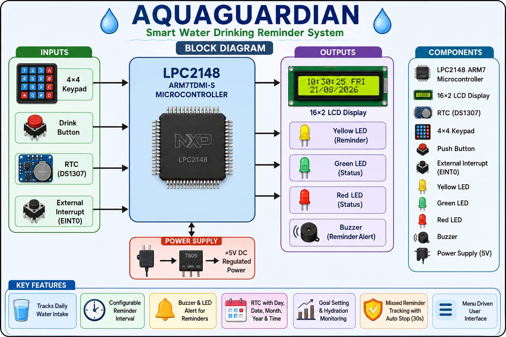
</p>

---

# ✨ Key Features

| Feature                           | Description                                     |
| --------------------------------- | ----------------------------------------------- |
| ⏰ **RTC**                         | Maintains current time, date and day            |
| 🔔 **Water Reminder**             | Generates reminders at the configured interval  |
| 🥤 **Drink Detection**            | Push button acknowledges drinking water         |
| 📊 **Hydration Tracking**         | Tracks goal, consumed, remaining and percentage |
| 🎯 **Daily Goal**                 | User-configurable water consumption goal        |
| 🔴 **Red LED**                    | Indicates low hydration progress                |
| 🟡 **Yellow LED**                 | Indicates an active drinking reminder           |
| 🟢 **Green LED**                  | Indicates daily hydration goal achieved         |
| 🔊 **Buzzer**                     | Provides audible reminder alert                 |
| ⌨️ **4×4 Keypad**                 | Used for configuration and numeric input        |
| ⚡ **EINT0**                       | Provides quick access to configuration menu     |
| 🖥️ **16×2 LCD**                  | Displays system information and status          |
| 🥛 **Custom LCD Graphics**        | Displays filled and empty glass symbols         |
| ⏱️ **30-Second Reminder Timeout** | Automatically stops an unanswered reminder      |
| 📌 **Missed Reminder Counter**    | Tracks reminders that were not acknowledged     |

---

# 🧠 System Concept

<p align="center">
  
</p>

---

# 🖥️ LCD User Interface

AquaGuardian uses a **16×2 LCD** as the primary user interface.

## 🏠 Home Screen — Time & Date

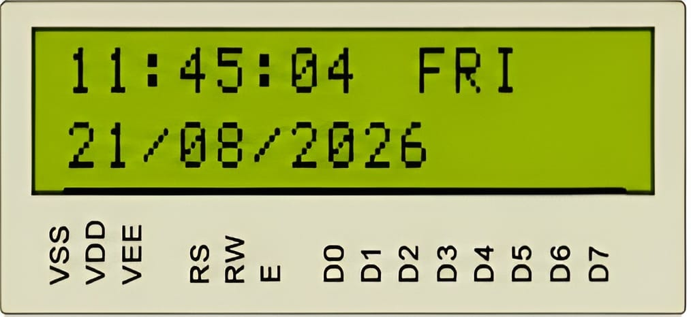

Displays:

* Current time
* Day of the week
* Current date

---

## 💧 Home Screen — Hydration Status

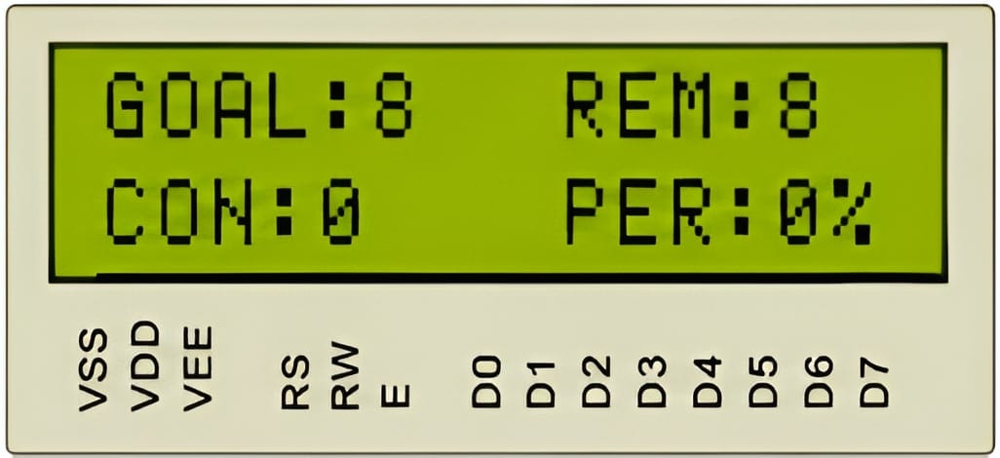

Displays:

* 🎯 Daily goal
* 💧 Remaining glasses
* 🥤 Consumed glasses
* 📊 Hydration percentage

---

## 🔔 Home Screen — Next Reminder

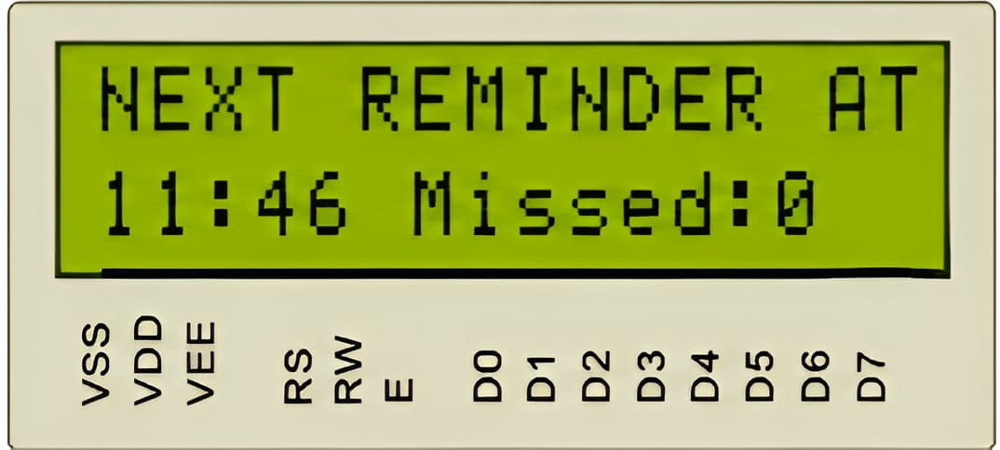

Displays the next scheduled reminder and the number of missed reminders.

---

# 🚨 Reminder Screen

When the reminder interval expires, AquaGuardian enters **Reminder Mode**.

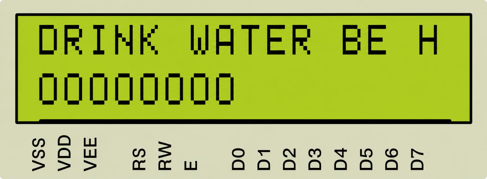

The reminder includes:

* 🟡 Yellow LED
* 🔊 Buzzer
* 📢 Scrolling reminder message
* 🥛 Visual glass indicators

The reminder remains active for **30 seconds** if the user does not acknowledge it.

---

# 🥛 Water Consumption Tracking

When the user presses the **Drink Switch** during a reminder:

```text
Drink Switch
      │
      ▼

 Stop Reminder
      │

       ├── 🔊 Buzzer OFF
       ├── 🟡 Yellow LED OFF
      │
      ▼

  DrinkWater()
      │

       ├── Consumed++
       ├── Remaining--
       └── Percentage Updated
             │
             ▼

        Next Reminder
```

Example:

```text
Before Drinking

┌────────────────┐
│ GOAL:8  REM:6  │
│ CON:2   PER:25%│
└────────────────┘


After Drinking

┌────────────────┐
│ GOAL:8  REM:5  │
│ CON:3   PER:37%│
└────────────────┘
```

---

# ⏱️ Reminder Timeout

If the user does not press the Drink Switch:

```text
Reminder Starts
      │
      ▼

🟡 Yellow LED ON
🔊 Buzzer ON
      │
      ▼

   30 Seconds
      │
      ▼

Reminder Timeout
      │

       ├── 🟡 LED OFF
       ├── 🔊 Buzzer OFF
       ├── MissedReminders++
      │
      ▼

Next Reminder Scheduled
```

A missed reminder **does not increase the consumed-water count**.

---

# 🎯 Goal Completion

When:

```text
Consumed >= Goal
```

the system considers the daily hydration goal completed.

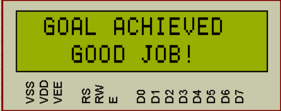

🟢 **Green LED ON**

The reminder task also stops generating further reminders after the goal is completed.

---

# ⚙️ Configuration Menu

The user can enter configuration mode using **EINT0**.

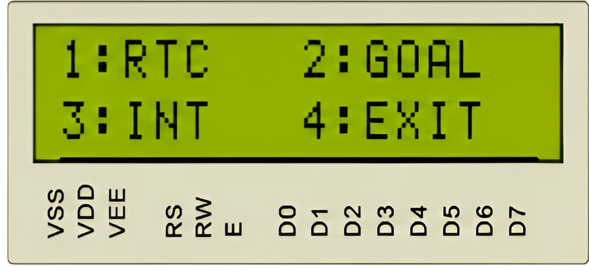

### RTC Menu

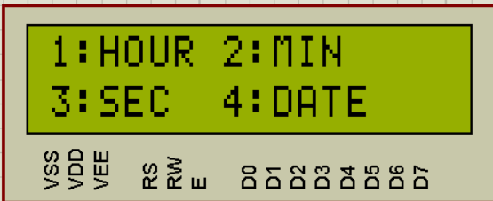

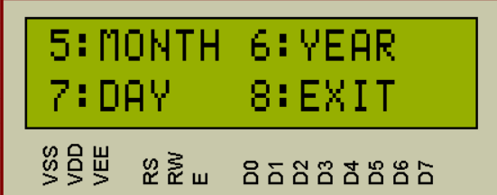

### Available Configuration

```text
       CONFIGURATION
             │

       ┌──────┼──────┐
       │      │      │
       ▼      ▼      ▼
      RTC    GOAL   INTERVAL
       │      │      │
       ▼      ▼      ▼
    Time/   Daily   Reminder
    Date    Goal    Interval
```

---

# ⌨️ Keypad Interface

The project uses a **4×4 matrix keypad**.

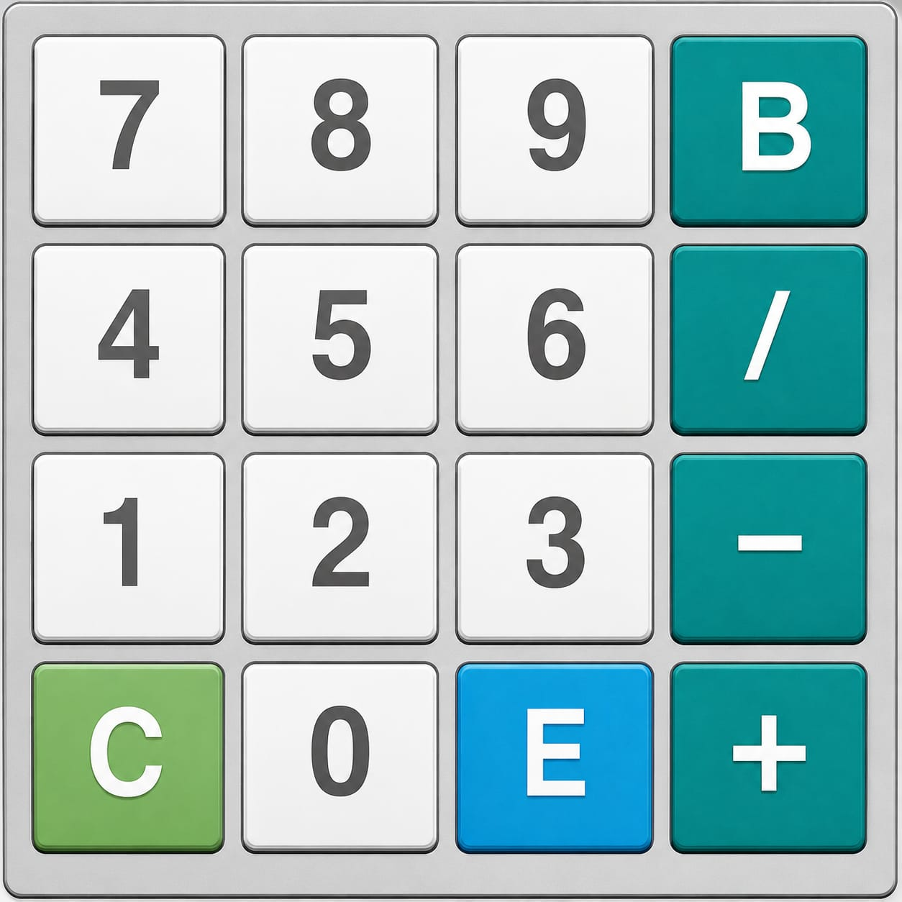

During numeric input:

```text
0–9 → Enter number
B   → Backspace
C   → Clear
E   → Enter
```

Example:

```text
┌────────────────┐
│ Enter Interval:│
│      15        │
└────────────────┘
```

---

# 🔌 Hardware Used

| Component             | Purpose                   |
| --------------------- | ------------------------- |
| **LPC2148**           | Main ARM7 microcontroller |
| **16×2 LCD**          | User interface            |
| **4×4 Matrix Keypad** | Configuration/input       |
| **RTC**               | Time/date tracking        |
| **Push Button**       | Drink acknowledgement     |
| **Red LED**           | Low hydration indication  |
| **Yellow LED**        | Reminder indication       |
| **Green LED**         | Goal completion           |
| **Buzzer**            | Audible reminder          |
| **EINT0**             | Configuration interrupt   |

---

# 🔌 Circuit Details

The AquaGuardian hardware is built around the **LPC2148 ARM7 microcontroller** with the following major interfacing blocks:

### 🧩 Circuit Connections

| Module                | Interface / Connection   | Purpose                                                 |
| --------------------- | ------------------------ | ------------------------------------------------------- |
| **LPC2148 ARM7**      | Main controller          | Executes the complete application                       |
| **16×2 LCD**          | GPIO interface           | Displays time, date, hydration and reminder information |
| **4×4 Matrix Keypad** | GPIO rows/columns        | Configuration and numeric input                         |
| **Internal RTC**      | LPC2148 RTC peripheral   | Maintains time, date and day                            |
| **Drink Push Button** | GPIO input               | Acknowledges water consumption                          |
| **Red LED**           | GPIO output              | Indicates low hydration progress                        |
| **Yellow LED**        | GPIO output              | Indicates active reminder                               |
| **Green LED**         | GPIO output              | Indicates goal completion                               |
| **Buzzer**            | GPIO output              | Generates the reminder alert                            |
| **EINT0**             | External interrupt input | Provides quick access to configuration                  |

### ⚡ Circuit Working

1. The **LPC2148** initializes all peripherals after power-on.
2. The **RTC** provides the current time and date used for reminder scheduling.
3. The **LCD** continuously displays the current system and hydration status.
4. The **4×4 keypad** allows the user to configure the RTC, daily water goal and reminder interval.
5. When the configured reminder time is reached, the **yellow LED and buzzer** indicate an active reminder.
6. Pressing the **Drink Switch** acknowledges the reminder and updates the consumed-water count.
7. The **red LED** indicates low hydration progress, while the **green LED** indicates that the daily goal has been achieved.
8. **EINT0** provides quick access to the configuration menu.

> **Note:** The exact GPIO pin assignments depend on the final Proteus schematic/hardware wiring. The circuit description above preserves the project functionality without inventing pin numbers not specified in the original README.

---

# 💻 Software

```text
Microcontroller : LPC2148 ARM7
IDE             : Keil µVision
Language        : Embedded C
Simulation      : Proteus
LCD             : 16×2 Character LCD
Keypad          : 4×4 Matrix Keypad
RTC             : LPC2148 Internal RTC
```

---

# 🧩 Software Architecture

```text
                 ┌────────────────────┐
                 │      main.c        │
                 │   System Control   │
                 └─────────┬──────────┘
                           │

        ┌──────────────────┼──────────────────┐
        │                  │                  │
        ▼                  ▼                  ▼
   ┌─────────┐       ┌───────────┐      ┌───────────┐
   │  rtc.c  │       │reminder.c │      │hydration.c│
   └─────────┘       └───────────┘      └───────────┘
        │                  │                  │
        └──────────────────┼──────────────────┘
                           │
                           ▼

                    ┌────────────┐
                    │ display.c  │
                    └─────┬──────┘
                          │
                          ▼
                       lcd.c
```

Supporting drivers:

```text
lcd.c
kpm.c
led.c
buzzer.c
delay.c
switch.c
eint.c
```

---

# 📁 Project Structure

```text
AquaGuardian/
│
├── 📄 README.md
│
├── 📁 Source/
│   ├── main.c
│   ├── interrupts_test.c
│   ├── rtc.c
│   ├── reminder.c
│   ├── hydration.c
│   ├── display.c
│   ├── lcd.c
│   ├── kpm.c
│   ├── led.c
│   ├── buzzer.c
│   ├── delay.c
│   └── switch.c
│
├── 📁 Include/
│   ├── types.h
│   ├── lcd.h
│   ├── lcd_defines.h
│   ├── rtc.h
│   ├── reminder.h
│   ├── hydration.h
│   ├── display.h
│   ├── kpm.h
│   ├── kpm_defines.h
│   ├── led.h
│   ├── buzzer.h
│   ├── delay.h
│   ├── switch.h
│   └── eint.h
│
├── 📁 Keil Project File/
│   └── 📄 AquaGuardian-Smart-Water-Drinking-Reminder-System.uvproj
│
├── 📁 Hex_file/
│   └── 📄 AquaGuardian-Smart-Water-Drinking-Reminder-System.hex
│
├── 📁 Proteus Designs/
│   └── 📄 Aquaguardian_Design.pdf
│
└── 📁 Pictures/
    ├── 🖼️ Block Diagram.png
    ├── 🖼️ Config_menu.jpeg
    ├── 🖼️ Flow_diagram.jpeg
    ├── 🖼️ Goal_Achieved_Window.png
    ├── 🖼️ Keypad.jpeg
    ├── 🖼️ Lcd_outputs.jpeg
    ├── 🖼️ RTC_Config-1.png
    ├── 🖼️ RTC_Config-2.png
    ├── 🖼️ Reminder_alert.jpeg
    ├── 🖼️ System_concept_overview.jpeg
    ├── 🖼️ Welcome_window.png
    ├── 🖼️ Window-1_Lcd.jpeg
    ├── 🖼️ Window-2_Lcd.jpeg
    └── 🖼️ Window-3_Lcd.jpeg
```

---

# 🔄 Complete System Flow

<p align="center">
  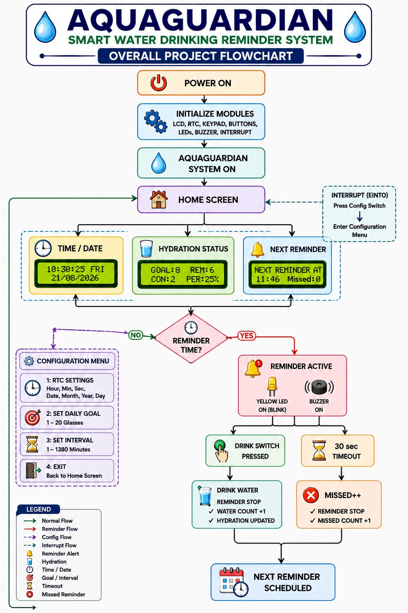
</p>

---

# 🟢 LED Status

```text
🔴 RED LED
   ↓

Low hydration progress
Percentage < 50%


🟡 YELLOW LED
   ↓

Reminder currently active


🟢 GREEN LED
   ↓

Daily hydration goal achieved
```

---

### 🖥️ LCD Output Screens

The following image shows the different LCD outputs and display screens of the AquaGuardian system during operation.

<p align="center">
  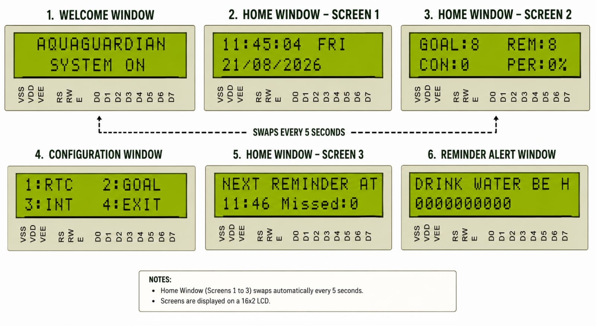
</p>

<p align="center">
  <i>Figure: AquaGuardian LCD Display Outputs</i>
</p>

---

# 🧮 Algorithm

The following algorithm illustrates the step-by-step working of the **AquaGuardian Smart Water Drinking Reminder System**.

<p align="center">
  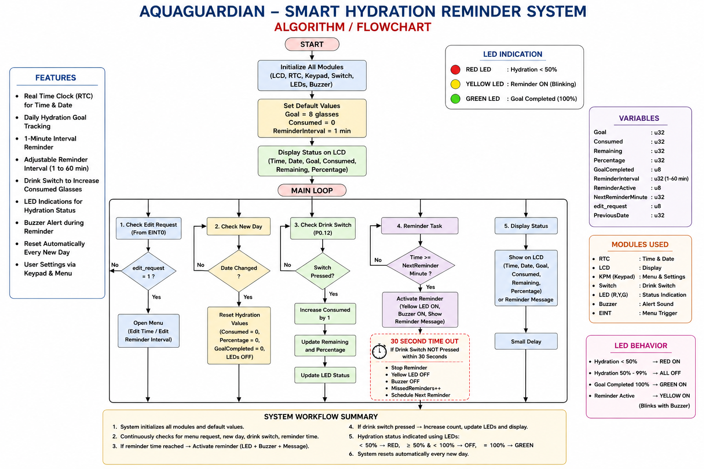
</p>

<p align="center">
  <i>Figure: AquaGuardian System Algorithm</i>
</p>

### 📌 Algorithm Flow

The system continuously performs the following operations:

1. Initialize the **LPC2148**, RTC, LCD, keypad, LEDs, buzzer and other peripherals.
2. Display the current **time, date and hydration status** on the LCD.
3. Check whether the daily hydration goal has been completed.
4. Monitor the configured reminder interval.
5. When the reminder time is reached, activate the **Yellow LED and Buzzer**.
6. Display the drinking reminder message on the LCD.
7. Check whether the user presses the **Drink Switch**.
8. If the Drink Switch is pressed:

   * Stop the buzzer and reminder.
   * Increment the consumed-water count.
   * Update the remaining water and hydration percentage.
   * Schedule the next reminder.
9. If the user does not respond within **30 seconds**:

   * Stop the reminder.
   * Turn OFF the buzzer and Yellow LED.
   * Increment the missed reminder counter.
   * Schedule the next reminder.
10. Continuously repeat the process until the daily hydration goal is achieved.

# 🧠 Embedded Concepts Demonstrated

This project brings together several important embedded-systems concepts:

* 🔹 ARM7 LPC2148 programming
* 🔹 GPIO configuration
* 🔹 LCD interfacing
* 🔹 Matrix keypad scanning
* 🔹 RTC programming
* 🔹 External interrupts
* 🔹 VIC interrupt configuration
* 🔹 Timer-independent software scheduling
* 🔹 State-based application flow
* 🔹 User input validation
* 🔹 Custom LCD characters
* 🔹 Buzzer control
* 🔹 LED status indication
* 🔹 Embedded C modular programming
* 🔹 Peripheral driver development

---

# 🛠️ Important Functions

### RTC

```c
RTC_Init()
SetRTCTimeInfo()
GetRTCTimeInfo()
SetRTCDateInfo()
GetRTCDateInfo()
SetRTCDay()
GetRTCDay()
```

### Hydration

```c
Hydration_Init()
DrinkWater()
ResetHydration()
SetGoal()
```

### Reminder

```c
Reminder_Init()
StartReminder()
StopReminder()
StopReminderTimeout()
Reminder_Task()
SetReminderInterval()
UpdateNextReminder()
```

### Display

```c
DisplayWelcome()
DisplayStatus()
DisplayReminder()
DisplayGoalComplete()
DisplayNextReminder()
DisplayHydrationStatus()
DisplayTimeDate()
DisplayTimeOnly()
ScrollReminderMessage()
```

### Keypad

```c
Init_KPM()
keyscan()
keyscan_nb()
ReadNumLCD()
```

---

# 🧪 Example Demonstration

Suppose:

```text
Daily Goal      = 8 glasses
Reminder        = Every 1 minute
Consumed        = 0
```

The system starts:

```text
┌────────────────┐
│ 11:45:00 FRI   │
│ 21/08/2026     │
└────────────────┘
```

After the reminder interval:

```text
┌────────────────┐
│ DRINK WATER BE │
│ 🥛 🥛 🥛 🥛 ...│
└────────────────┘

🔊 BUZZER ON
🟡 YELLOW LED ON
```

User presses the Drink Switch:

```text
Consumed = 1
Remaining = 7
Percentage = 12%
```

The next reminder is automatically scheduled.

If the user doesn't respond for 30 seconds:

```text
MissedReminders++
```

and the system returns to normal operation.

---

# 🚀 Future Improvements

Possible future enhancements include:

* 📱 Mobile application connectivity
* ☁️ IoT/cloud-based hydration monitoring
* 📈 Daily/weekly hydration statistics
* 🔋 Battery-backed RTC
* 👤 Multiple user profiles
* 🔔 Custom reminder tones
* 🌡️ Environmental sensor integration
* 📊 Graphical hydration history
* 🕐 Smarter reminder scheduling
* 💾 EEPROM-based user settings storage

---

# 🎓 Project Purpose

The main purpose of AquaGuardian is to demonstrate how multiple embedded peripherals can be integrated into a **single real-time interactive application**.

Instead of treating the RTC, LCD, keypad, interrupts, GPIO, LEDs and buzzer as isolated experiments, this project combines them into one practical embedded system.

> **A small embedded system with a simple goal: remind, track, and encourage better hydration. 💧**

---

# 👨‍💻 Project

**AquaGuardian — Smart Water Drinking Reminder System**

## 👨‍💻 Author

**BURRI SRIHARI**

### 🔧 Embedded Systems / ARM7 Project

**Platform:** LPC2148 ARM7
**Development Environment:** Keil µVision
**Programming Language:** Embedded C
**Application Area:** Embedded Systems / Healthcare / Smart Monitoring

---

<p align="center">
  <b>💧 Stay Hydrated • Stay Healthy • Stay Alert 💧</b>
</p>

<p align="center">
  ⭐ If you find this project useful, consider giving the repository a star!
</p>
